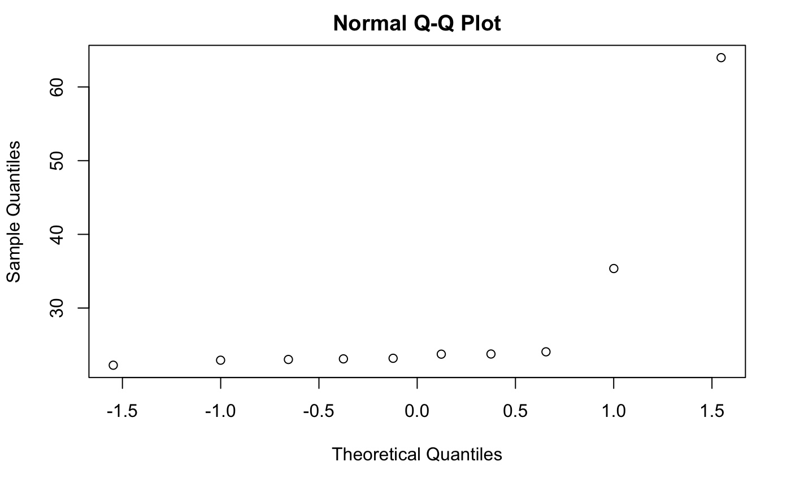
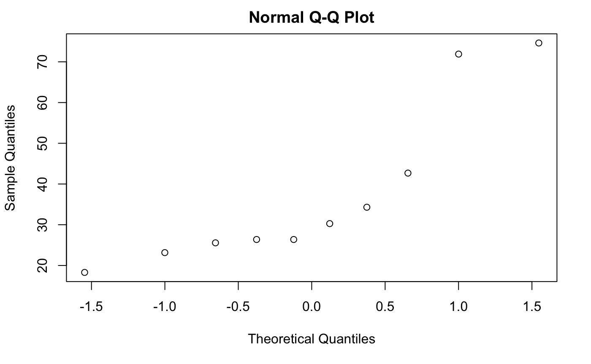

# Occupancy Detection using Room Attributes( such as Temperature, humidity etc):

The following project is about implementing a prediction model to detect room-oocupany based on certain features such as Room temperature etc. It is a binary classification task to detect weather there is a person in the room or not. 


<!-- START doctoc generated TOC please keep comment here to allow auto update -->
<!-- DON'T EDIT THIS SECTION, INSTEAD RE-RUN doctoc TO UPDATE -->
**Table of Contents**  *generated with [DocToc](https://github.com/thlorenz/doctoc)*


- [Description](#description)
- [Data:](#data)
- [features:](#features)
- [post data preprocessing:](#post-data-preprocessing)
- [Prediction Models:](#prediction-models)
- [Comparisoin of  Models](#comparisoin-of--models)
    - [parametric:](#parametric)
    - [Linear assumption](#linear-assumption)
    - [parameters:](#parameters)
- [Significance T-test:](#significance-t-test)
    - [For Linear Regression:](#for-linear-regression)
    - [For Logistic Regression:](#for-logistic-regression)
    - [For Logistic Regression using RBF Transformation:](#for-logistic-regression-using-rbf-transformation)
- [Testing](#testing)
- [conclusion](#conclusion)
    - [Which model performs better?](#which-model-performs-better)
    - [Improve the performance of RBF:](#improve-the-performance-of-rbf)
    - [Use Cross validation instead of Multiple random Test-train split:](#use-cross-validation-instead-of-multiple-random-test-train-split)
    - [Normalize the data:](#normalize-the-data)
    - [Have implemented Naive Bayes but removed it.:](#have-implemented-naive-bayes-but-removed-it)

<!-- END doctoc generated TOC please keep comment here to allow auto update -->


## Description
The following project is about implementing a prediction model to detect room-oocupany based on certain features such as Room temperature etc. It is a binary classification task to detect weather there is a person in the room or not


## Data:

The data set is obtained from https://archive.ics.uci.edu/ml/datasets/Occupancy+Detection+#
It is one of UCI machine learning repository.


## features:

The dataset has the following features:        
1.) date time year-month-day hour:minute:second     
2.) Temperature, in Celsius     
3.) Relative Humidity, %     
4.) Light, in Lux     
5.) CO2, in ppm     
6.) Humidity Ratio, Derived quantity from temperature and relative humidity, in kgwater-vapor/kg-air 
7.) Occupancy, 0 or 1, 0 for not occupied, 1 for occupied status    

The last column is the 0 or 1 target variable.    


## post data preprocessing:

1.) convert date time to two columns : month and hour    
2.)  remove time stamp     
3.)  remove id column not required    
4.)  remove quotations    
5.)  combine train and test    

data is transformed to  7 features and one target column      

Now the data has the following features:
1.) month    
2.) hour    
3.) Temperature, in Celsius     
4.) Relative Humidity, %     
5.) Light, in Lux     
6.) CO2, in ppm     
7.) Humidity Ratio, Derived quantity from temperature and relative humidity, in kgwater-vapor/kg-air 
Occupancy, 0 or 1, 0 for not occupied, 1 for occupied status    

## Prediction Models:

I have used the following Three methods:    
1.) Linear Regression classifer     
2.) Logistic Regression    
3.) RBF with Logistic Regression: (beta : 0.5)    

## Comparisoin of  Models

#### parametric:

All three models are parametric

#### Linear assumption

They assume that the features are linearly dependent with the target

#### parameters:

The linear regression uses a a regularizer of 0.01    
The RBF uses a Bandwidth of 0.05    


## Significance T-test:

Lets do one sample test for the erros that were generated for each model seperately:(The tests have ben done in R)    

#### For Linear Regression:

The errors are : 63.98  23.02  24.06  35.36  23.74  23.76  23.1   23.18  22.24  22.92

```r
errors = c(63.98, 23.02,  24.06,  35.36,  23.74,  23.76,  23.1,   23.18,  22.24,  22.92)
qqnorm(errors)
t.test(errors, mu= mean(errors))
```





	One Sample t-test
  data:  errors
  t = 0, df = 9, p-value = 1
  alternative hypothesis: true mean is not equal to 28.536
  95 percent confidence interval:
   19.21336 37.85864
  sample estimates:
  mean of x 
     28.536 
  


The pvalue 1 suggests that the Null hypothesis is true i.e the population mean of error is equal to the sample mean or error.

#### For Logistic Regression:

The errors are : 74.62  26.38  30.28  34.3   71.9   18.3   26.38  23.16  25.56  42.68

```{r}
errors = c(74.62,  26.38,  30.28,  34.3,   71.9,   18.3,   26.38,  23.16,  25.56,  42.68)
qqnorm(errors)
t.test(errors, mu= mean(errors))
```





	One Sample t-test
  data:  errors
  t = 0, df = 9, p-value = 1
  alternative hypothesis: true mean is not equal to 37.356
  95 percent confidence interval:
   23.02028 51.69172
  sample estimates:
  mean of x 
     37.356 


The pvalue 1 suggests that the Null hypothesis is true i.e the population mean of error is equal to the sample mean or error.


#### For Logistic Regression using RBF Transformation:

The errors are : 74.62  26.38  30.28  34.3   71.9   18.3   26.38  23.16  25.56  42.68     

```{r}
errors = c(74.6, 26.38,  30.28,  34.3,   71.9,   18.3,   26.38,  23.16,  25.56,  42.68)
qqnorm(errors)
t.test(errors, mu= mean(errors))
```


	One Sample t-test
  data:  errors
  t = 0, df = 9, p-value = 1
  alternative hypothesis: true mean is not equal to 37.354
  95 percent confidence interval:
   23.02124 51.68676
  sample estimates:
  mean of x 
     37.354 


The pvalue 1 suggests that the Null hypothesis is true i.e the population mean of error is equal to the sample mean or error.


## Testing

The data for training and testing is obtained by *multiple split tests*.     
In this approach for each iteration of testing/training we obtain random datapoints and split them into testing and training. This reduces the variance that is obtained with random process(only one iteration). We have taken ten runs of random test-train split. 


## conclusion


### Which model performs better?

Best parameters for RBF_LogitReg: {'regwgt': 0.01, 'beta': 0.5, 'regularizer': None}    
Average error for RBF_LogitReg: 37.356 +- 11.7834897458    
Best parameters for LogitReg: {'regwgt': 0.0, 'regularizer': 'None'}    
Average error for LogitReg: 37.356 +- 11.7834897458    
Best parameters for Random: {}    
Average error for Random: 49.838 +- 0.163558447535    
Best parameters for Linear Regression: {'regwgt': 0.01}    
*Average error for Linear Regression: 28.536 +- 7.66290479507*    

As you can see the linear regression performs better than the logistic regression(with or without RBF).
But still the logistic regression or the RBF can be fine tuned to obtained better results than the linear regression. 


### Improve the performance of RBF:

For The RBF transformation we have taken random centers. The idea behind centers is each center represents one example representative example of population. Since we have taken random this could have failed. Also the performance of RBF can be improved with taking more number of centers. 

  1.) Take more centers        
  2.) Take centers using clustering instead of random Centers.            
  
    
### Use Cross validation instead of Multiple random Test-train split: 

The problem with mulitple random test-train split is some of the data points are never included in the testing and some are never included in the training. So Cross validation method would be a better way to test/train the models. This way the avg error obtained is trustworthy.


### Normalize the data:


Most of the features are interdependent. So its better to normalize the data. Havent implemented is this for this project. 


###  Have implemented Naive Bayes but removed it.:

Implemented naive bayes but again removed it. Because the features are clearly dependent on each other.     
For example if a person is in the room, the temperature increases. Also increase in moisture increases the temperature too. And a person may contribute to the moisture. Naive bayes assumes independent features hence decided not to use naive bayes.


